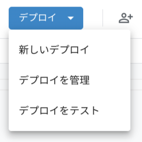
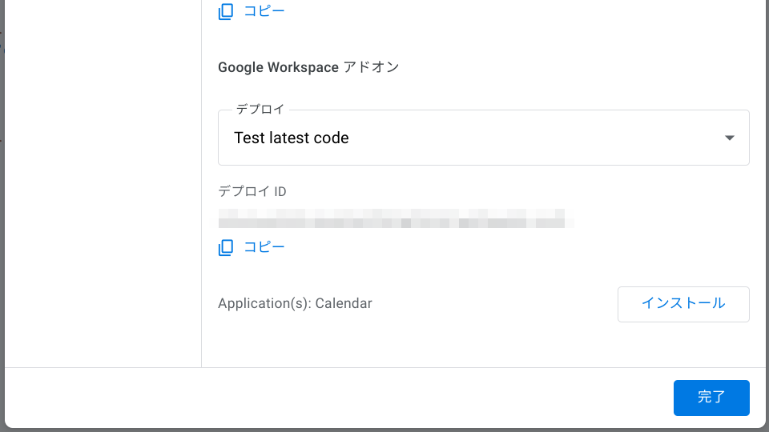

[](https://github.com/google/clasp)

# gas-addon-exportcalendar

Google カレンダーを印刷する Google Workspace アドオン

<!-- ## Installation -->
## 開発環境の構築

[npm](https://www.npmjs.com/) : パッケージの管理

[clasp](https://github.com/google/clasp) : GAS プロジェクトをローカル環境で開発するためのツール

[Google Apps Script](https://script.google.com) : GAS プロジェクトのデプロイやテストを行うためのシステム

```shell
# clasp をインストールする
$ npm install -g @google/clasp

# GAS 開発時に補完が効くようにパッケージをインストールする
# パッケージは package.json で指定 (@types/google-apps-script)
$ npm istall
```

## 開発の流れ

```shell
# レポジトリをローカル環境にクローンする
$ git clone https://github.com/tanykazy/gas-addon-exportcalendar.git
$ cd gas-addon-exportcalendar

# clasp を使い、ログインする
gas-addon-exportcalendar $ clasp login

# clasp で GAS プロジェクトを作成する
gas-addon-exportcalendar $ clasp create --type standalone --title addon-test 

# clasp でローカルのファイル群をクラウドの GAS 環境に push する
# -f オプションをつけると、強制的に上書きされる
gas-addon-exportcalendar $ clasp push -f    
```

<!-- ## Usage -->
## デプロイ

_デプロイをテスト_ をクリック



_インストール_ をクリックすると、ご自身の Workspace の Gmail の右側に、アドオンが表示されます。



<!-- ## Demo -->

<!-- Google カレンダーの予定の説明を含めて印刷する -->


## ライセンス

GNU General Public License v3.0 
